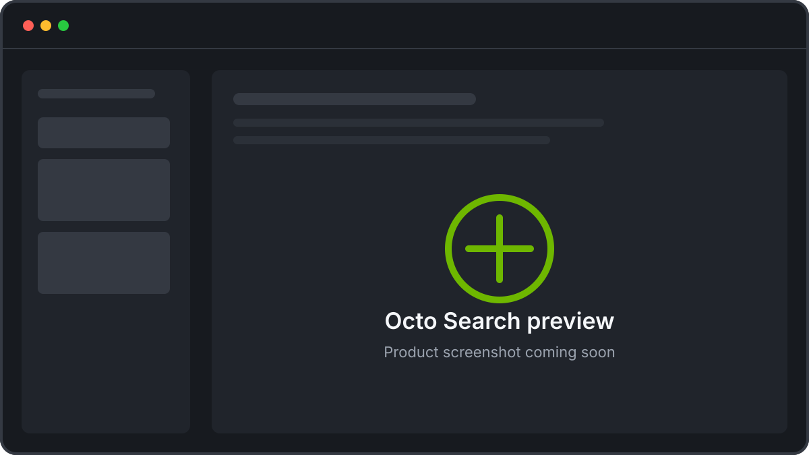
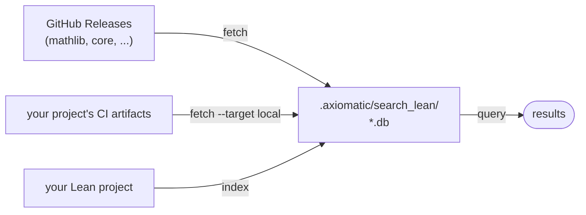

# Axiomatic Octo

  

**Axiomatic Octo** is a toolkit for Lean formalization workflows. **Octo
Search** lets you search semantically for declarations across Mathlib, core, Batteries, and your own Lean projects at once.

Octo gives every branch of your Lean repository its own search index, both for your own
own code and its dependencies, whether you work in **VS Code**, the **CLI**, or
with a **coding agent**.

!!! note "Status: alpha"
    Stable enough for daily use; APIs and file formats may still shift. This
    manual tracks `main`.

<figure markdown="1">

</figure>

## Try it without installing anything

Search the shared corpora from your browser at
[octo.axiomatic-ai.com/search](https://octo.axiomatic-ai.com/search). Searching
your *own* Lean project is what the [VS Code
extension](https://marketplace.visualstudio.com/items?itemName=AxiomaticAI.axiomatic-octo)
and the CLI add.

## Start here

- :material-download: **[Install](install.md)**

    Installing the CLI and extension, and configuring API keys.

- :material-open-in-new: **[Web search](https://octo.axiomatic-ai.com/search)**

    Query the shared corpora in your browser, nothing to install.

- :material-magnify: **[Set up search on your repo](setup-search.md)**

    A walkthrough of the setup checklist, from sign-in to your first query.

- :material-console: **[CLI reference](reference/cli.md)**

    Every command's `--help`, generated from the installed CLI.

- :material-tune: **[Configuration](reference/configuration.md)**

    Config layering, model aliases, and tuning knobs.

## The pipeline

Each corpus has a search database under `<project>/.axiomatic/search_lean/`:
a SQLite file with a [`sqlite-vec`](https://github.com/asg017/sqlite-vec)
vector index. Databases are either downloaded prebuilt or built locally from a
Lean project.

Indexing extracts Lean declarations with *lean-extract* (inspired by *jixia* and *doc-gen4*), describes each one informally with an LLM,
and embeds the descriptions with an open embedding model. Queries embed your question the same way and rank declarations by similarity.

## Getting help

- [Open an issue](https://github.com/Axiomatic-AI/octo/issues)
  for bugs and requests.
- [octo.axiomatic-ai.com](https://octo.axiomatic-ai.com/) for everything else
  about Octo.
