# Set up search on your repo

Indexing your repository runs on Axiomatic's servers either way, so both paths
below start by giving the Octo Search GitHub App read access to it. What differs
is where you search from, and how much of your repository is searchable.

**Web** is the short path: publish the repository and anyone can search it at
[octo.axiomatic-ai.com/search](https://octo.axiomatic-ai.com/search), with
nothing installed and no key. It serves the repository's **default branch**, and
only public repositories are eligible.

**VS Code** is the path you need to search *a specific branch* rather than a
repository. The extension pairs each checkout with its own database, so a
feature branch, a private repository, and declarations you have not pushed yet
are all searchable.

=== "Web"

    Listing a repository on the [Octo Search
    site](https://octo.axiomatic-ai.com/search) makes its declarations findable
    by anyone, there and through the [hosted MCP
    server](agents.md#octo-search-the-hosted-server).

    **1. Give the App access to the repositories you want to search.** Start
    from **Install / Configure on GitHub** on the [dashboard's search
    tab](https://octo.axiomatic-ai.com/dashboard). Prefer **Only select
    repositories** over **All repositories**: it grants less, and it is also
    less work, because repositories you pick by name here arrive enabled for
    search on their own.

    <figure markdown="1">
    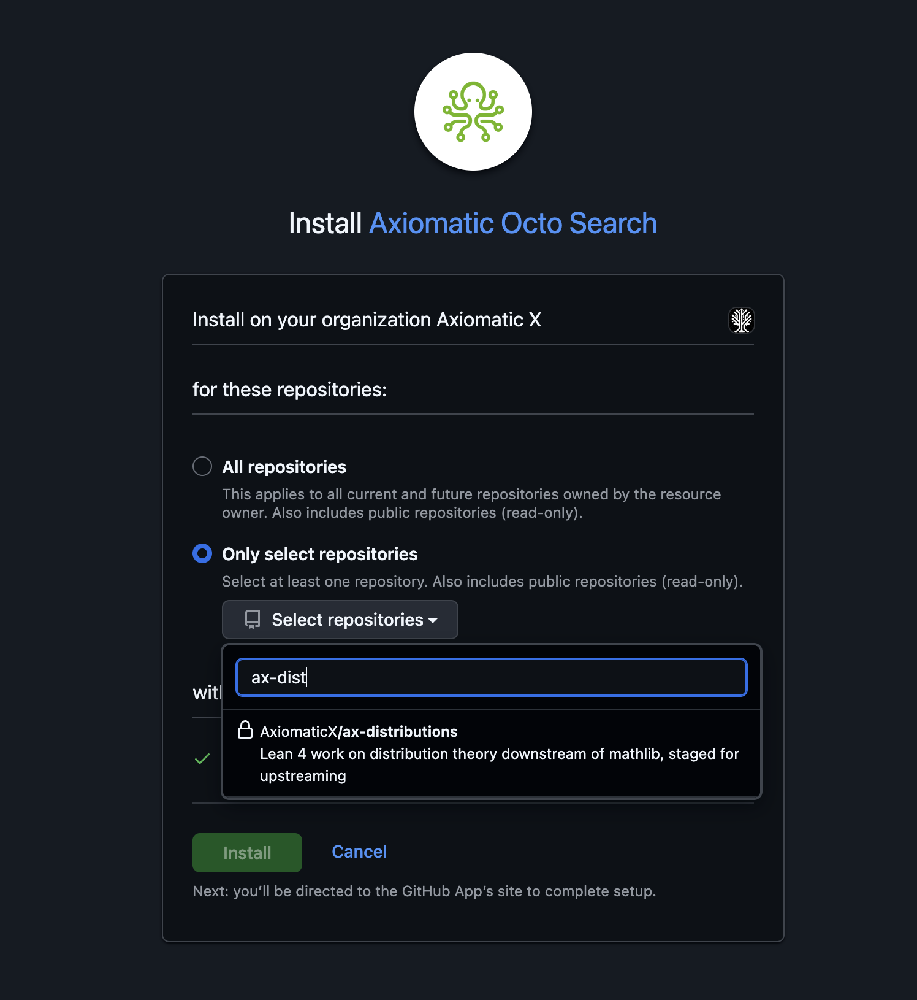{ width="470" }
    <figcaption>The choice on this screen is what decides whether step 1.5
    applies to you.</figcaption>
    </figure>

    **1.5. Only if you installed for all repositories: enable each repository
    for search.** An "All repositories" install enables nothing on its own. Add
    each one as `owner/name` under **Lean Search Repos** on the dashboard's
    search tab. Enabling a repository needs write access to it.

    <figure markdown="1">
    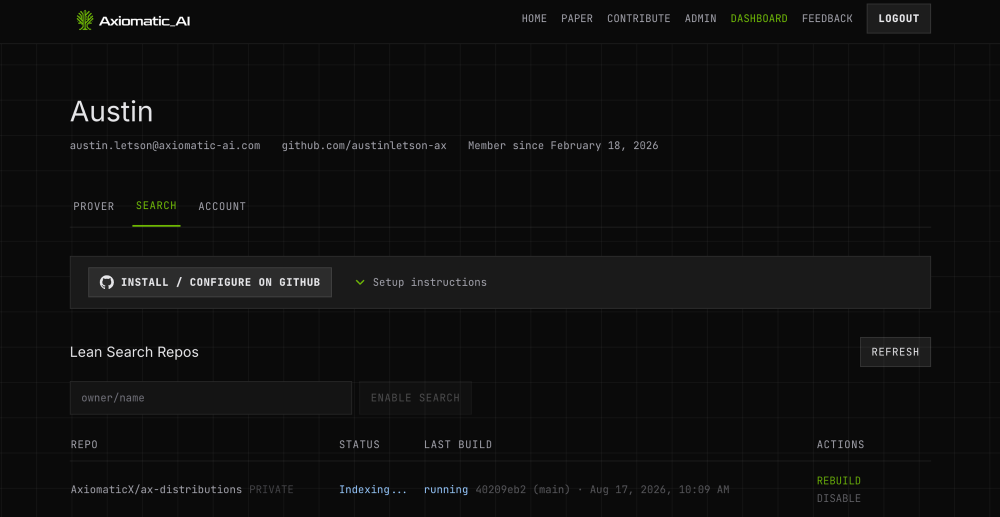
    </figure>

    **2. Publish it on the Octo Search site.** The row's **Publish on Octo
    Search website** action lists the repository; if its first index is still
    building, it appears when that finishes. Anyone can then find its
    declarations along with the AI-written descriptions Octo searches against.
    Only public repositories are eligible, and turning it off removes them.

    The first index starts as soon as a repository is enabled, and a push
    touching Lean sources builds a new one. The site serves the default
    branch's newest index, so a repository whose latest build is a feature
    branch is still served from its default branch. When a build fails for a
    reason on the repository's side, the table shows the message and a hint for
    fixing it.

=== "VS Code"

    Octo Search needs three things: an Axiomatic API key in this editor, the
    repository indexed on the server, and a search database on disk. The setup
    checklist in the Octo sidebar tracks all three.

    The following assumes the extension is [installed](install.md) and you have
    opened a Lean project that lives on GitHub.

    **1. Open the Octo sidebar.**

    <figure markdown="1">
    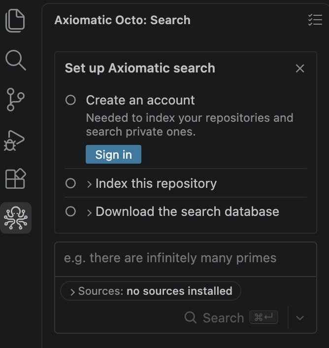{ width="370" }
    <figcaption>A fresh install: every row open, no databases installed.</figcaption>
    </figure>

    **2. Create an account.** **Sign in** opens your browser: authorize the app
    on GitHub, then connect this editor. Signing up for the first time also
    asks you to accept the terms and conditions.

    <figure markdown="1">
    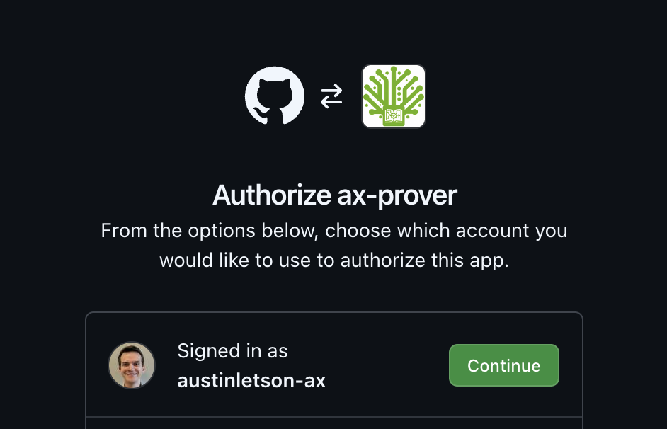{ width="470" }
    </figure>

    <figure markdown="1">
    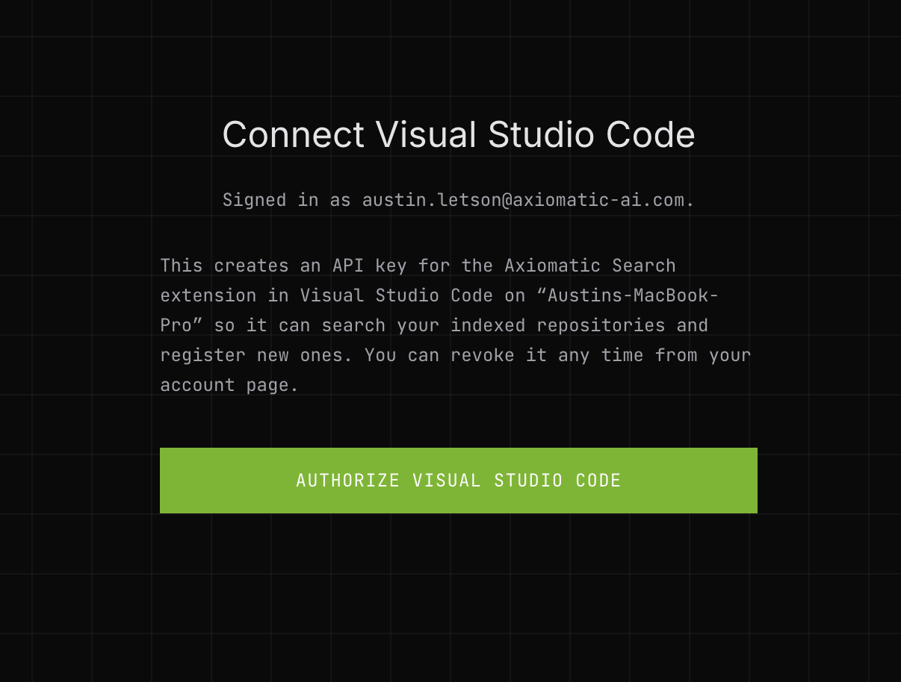{ width="470" }
    <figcaption>Mints an API key for this machine. Revoke it any time from your
    account page.</figcaption>
    </figure>

    **3. Give Octo Search access to the repository.** Indexing runs
    server-side, so the GitHub App needs read access. Expand **Index this
    repository**; each row says what it is waiting for. (Dependencies like
    Mathlib ask for nothing: see [why your repo needs access and Mathlib does
    not](faq.md#repo-permissions).)

    <figure markdown="1">
    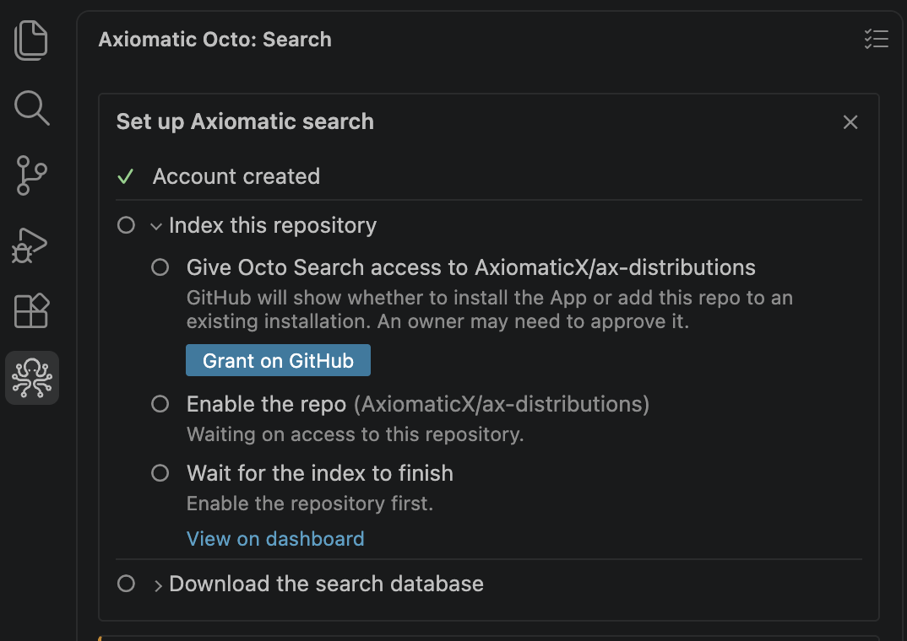{ width="520" }
    </figure>

    **Grant on GitHub** opens the App's install page. Install for all
    repositories, or pick just this one. Under an organization, an owner may
    have to approve it.

    <figure markdown="1">
    { width="470" }
    </figure>

    **4. Indexing starts.** GitHub sends you to the dashboard, where the build
    appears.

    <figure markdown="1">
    
    </figure>

    Nothing else to do here — the extension polls in the background and enables
    the repository itself, so the panel has moved on by the time you switch
    back.

    <figure markdown="1">
    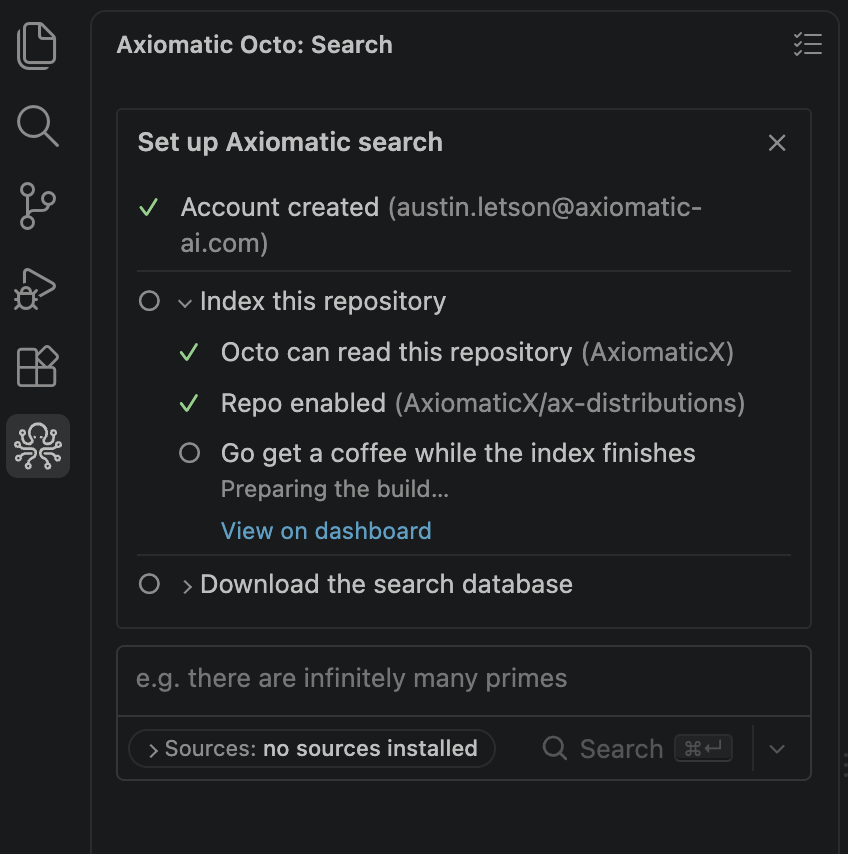{ width="420" }
    <figcaption>Take longer than four minutes on GitHub and the row offers
    <strong>Check again</strong>: the watch gave up, not the install.</figcaption>
    </figure>

    **5. The search databases download themselves.** Indexing produces a
    database on the server; searching reads one from disk. Once the index is
    built there is nothing to decide, so the extension starts the downloads
    itself and the rows report progress.

    <figure markdown="1">
    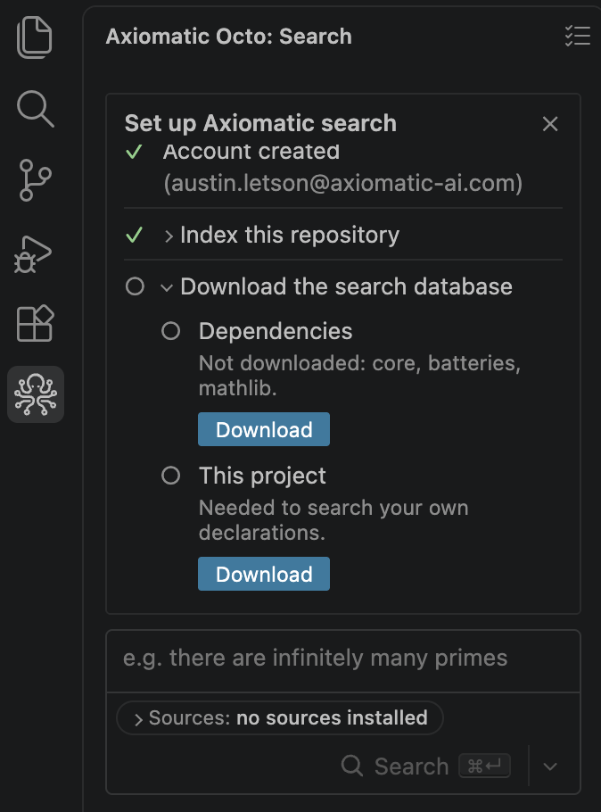{ width="370" }
    <figcaption><strong>Dependencies</strong> is the prebuilt corpora your project
    uses; <strong>This project</strong> is your own declarations.</figcaption>
    </figure>

    Dependency databases are cached per machine, so you pay for Mathlib once.
    Each row keeps a **Download** button, which is the retry if one fails.

    **6. Search.** When the last database lands, a final row names what you can
    now search: the dependency corpora and your own repo. The checklist stays
    put until you click **Dismiss** on it.

    Then describe what you want, not its name.

    <figure markdown="1">
    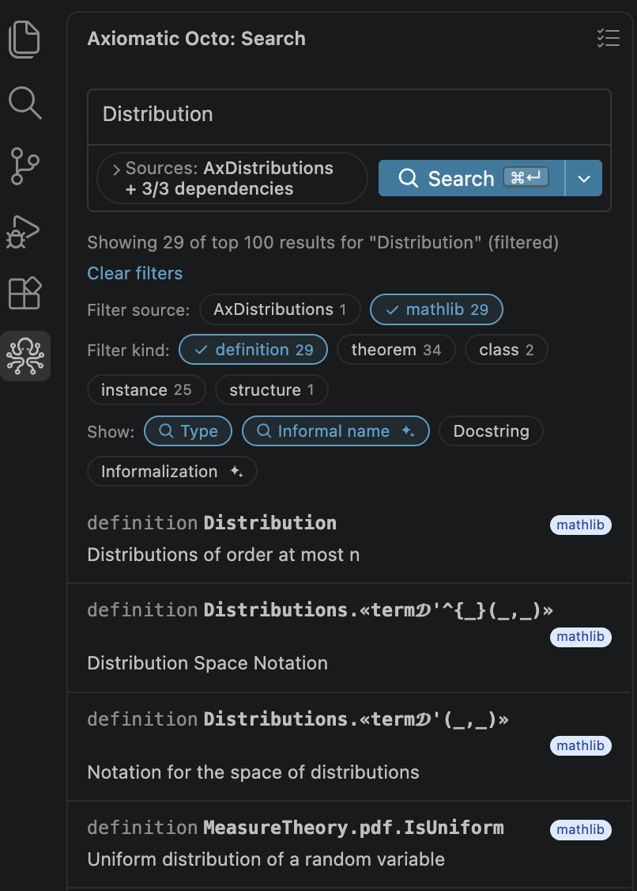{ width="400" }
    <figcaption>Corpus and declaration kind are both filters.</figcaption>
    </figure>

    <figure markdown="1">
    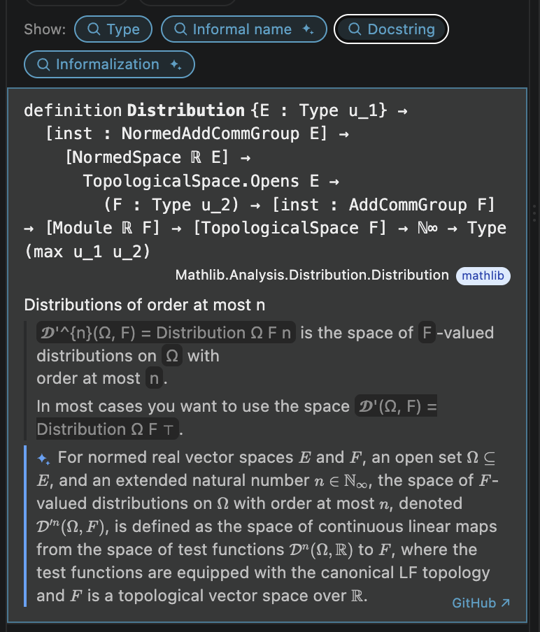{ width="380" }
    <figcaption>The ✦ paragraph is the description Octo embedded and searched
    against.</figcaption>
    </figure>

    <figure markdown="1">
    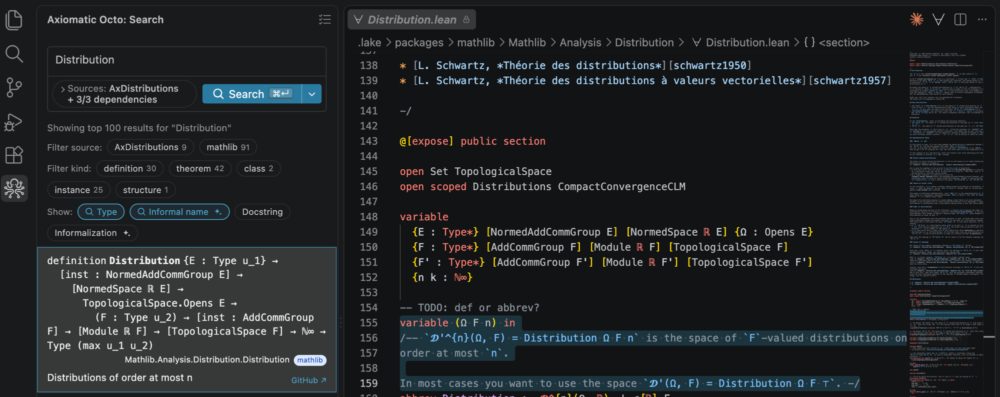
    <figcaption>Clicking a result opens the declaration in its source file.</figcaption>
    </figure>

    **If setup does not complete**, run **Octo: Show Output** for the logs; the
    dashboard's search tab has the full build log for a failed index.

## Searching from the terminal or an agent

Both paths above are also reachable outside the editor. The CLI queries the same
databases the extension downloads — see the [CLI
reference](reference/cli.md) for querying, fetching, and indexing. For coding
agents, `octo-mcp` searches your project's own databases and the hosted server
searches the published corpora: [Agents and MCP](agents.md).
